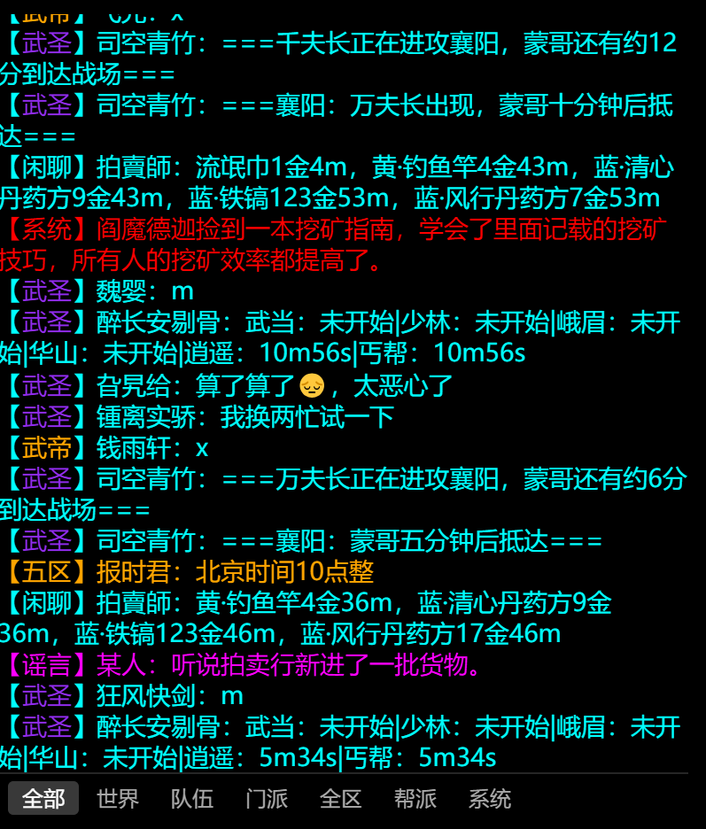
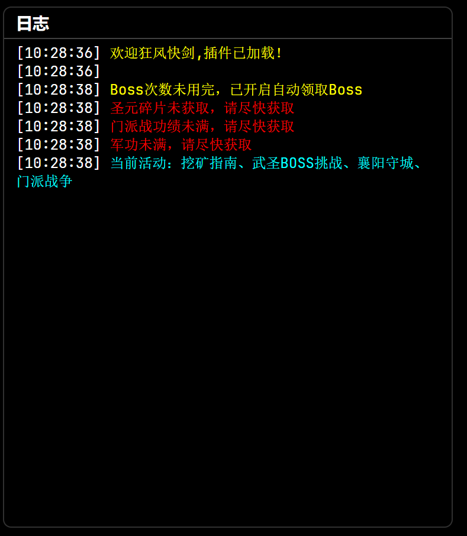
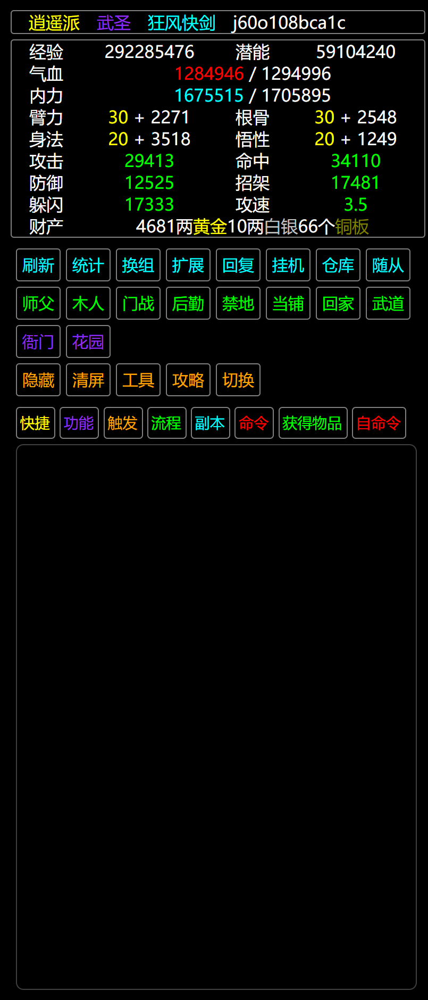

# WSMUD2 浏览器扩展
该扩展可以增强玩家游玩武神传说MUD2游戏的体验。主要改变了布局、添加了一些快捷功能。

## 聊天区域
安装该扩展后，聊天区域应该默认显示在屏幕的右侧上方。聊天区域的下方是一个聊天分类栏。

点击聊天区域中发送聊天消息的玩家名可以查看该玩家。

## 日志区域
日志区域在聊天区域之下，会显示整个插件的日志。

## 主游戏区域
该扩展保留了原版游戏的界面，只是在宽度上做扩充。右下角有2个按钮“命令代码”和“自动攻击”。前者是指在客户端发送游戏命令后在游戏区域显示时间戳和这个命令，比如打开属性的`score`命令；后者是指在战斗中自动使用技能。

## Raid.js、信息区域
该区域默认在最左侧，有属性面板、快捷按钮、Raid.js选项卡等。Raid.js主要包括触发器、流程之类。

